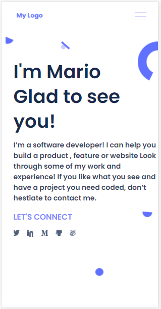
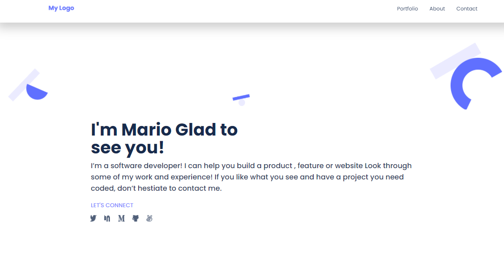

# mobile_version_skeleton

> Creating a mobile version skeleton from Figma template

First project from Figma template

## Link

- https://hunter4466.github.io/mobile_version_skeleton/

## Built With

- Html, Javascrip
- Developed in VSCode

To get a local copy up and running follow these simple example steps.

## Authors

👤 **Author**

- GitHub: [@githubhandle](https://github.com/hunter4466)

## 🤝 Contributing

Contributions, issues, and feature requests are welcome!

Feel free to check the [issues page](../../issues/).

## Show your support

Give a ⭐️ if you like this project!

## 📝 License

This project is [MIT](./MIT.md) licensed.